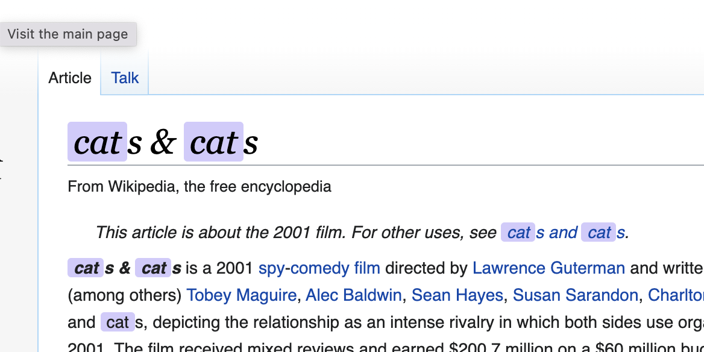

# Test task: MeoWoof - the extension for Google Chrome

This extension includes three entry points:
- **dist/popup.html**: popup as a Vue application (it's necessary to build it before use the extension);
- **background.js**: service worker which sets up the extension's storage;
- **contentScript.js**: content script which does replacements on the web page.


## Building the popup application
_Note_: Node >= 16 is recommended in order for this to work correctly.
```
npm install
npm run build
```

## Installing
1. Clone the project to a directory (e. g. <my_directory>).
2. Go inside the directory and build the popup application.
3. Open Google Chrome and go to the extensions page (chrome://extensions/).
4. Toggle on developer's mode if it's not enabled yet.
5. Load the extension from <my_directory>.

## Using
1. Press the Extensions button on the top right panel of the browser and toggle the pin near the extension.

The extensions icon will appear on the top right panel.

2. While on some web page, click on Meowoof extension icon. The popup will be displayed.

As you can see, the extension is enabled by default and "cats" option is selected.

3. If the extension is enabled, "Apply to the current tab" button is shown. Press the button to process the page.

All "cat" and "dog" occurences (case insensitive) will be replaced and highlighted according to the current settings. If there is only one option selected it will be the replacement, if there are both options or none of them selected, there will be no effect.
_Note_: currently all replacements are lowercased regardless of the original occurences casing.
4. Once the particular replacement is done, subsequent applications (with another or the same settings) will have no effect. Reload the page in order for the extension to be able to process the page again.
